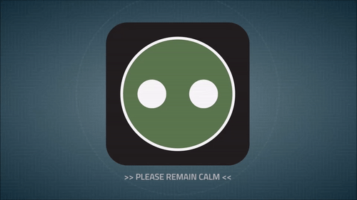

# Halo ODST Superintendent Loader
An animated loader based on the superintendent AI from Halo ODST.

## Live Demo
A live demo is available on [CodePen](https://cdpn.io/wvjyPwX) and [Netlify](https://halo-odst-loader.netlify.app/).

## License
This project is licensed under the MIT License - see the [license.md](license.md) file for details.

## Project Setup

From the root directory, install project dependencies by running `npm install` from the terminal.

Build the files and start the local dev server by running `npm run dev` from the terminal. This should open the dev site automatically at http://localhost:3000/.

You can build the files without starting the dev server by running `npm run build` from the terminal to compile the development build or `npm run prod` to compile the production build.